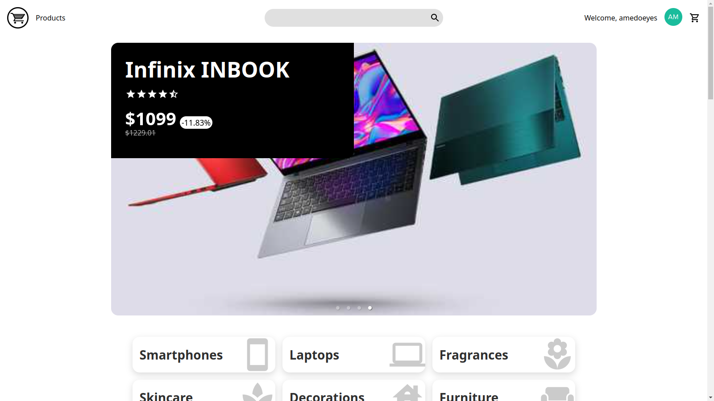

# OShop



OShop is a React-based e-commerce front-end that uses TypeScript, Redux, React Router, Sass, Axios and Auth0 for authentication.

Deployed Project: https://amedoeyes-oshop.vercel.app/

## Installation

To install and build the project, run the following command:

```
npm i && npm run build
```

This will install all dependencies and build the project.
